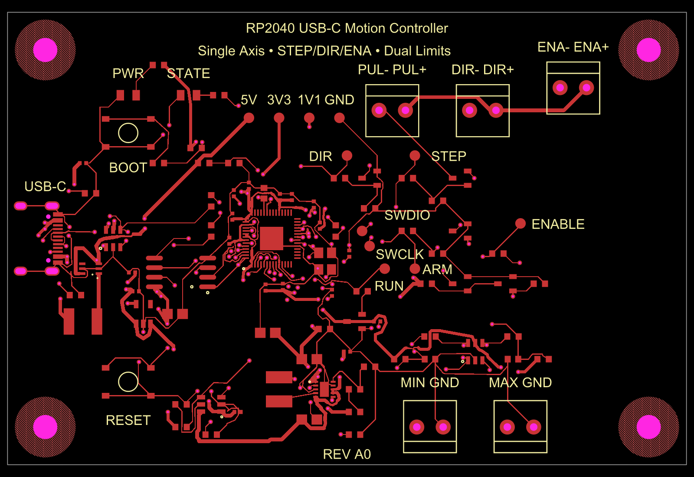

# RP2040 USB-C Single-Axis Stepper Motion Controller for External DM542T Drivers with STEP/DIR/ENABLE Outputs and Dual Limit-Switch Inputs

**Revision A0 — untested prototype. Four-layer candidate fails routing validation. Not fabrication ready; do not order the historical exports.**

USB-C powers an RP2040 and connects a computer to one external STEPPERONLINE DM542T V4.0. The external driver supplies motor current from its own supply. This board carries control signals only. The public package includes circuit sources, the complete sourcing BOM, firmware sources and tests. Detailed investigation artifacts and compiled firmware remain local. The prototype.13 audit missed two via-to-via copper clearance violations. The four-layer candidate still fails routing, via clearance and ground-plane enforcement; see the recorded toolchain fix and remaining blockers. Historical manufacturing exports are retained for traceability and are not approved for ordering. See [VALIDATION.md](VALIDATION.md).

All 85 fitted components have exact JLCPCB mappings in [BOM.md](BOM.md) and [bom.csv](bom.csv). These are sourced parts, not an approved assembly package.

## Wiring for the selected driver

Target: **DM542T V4.0, manual revision 4.0, October 2020**. Set the driver's **S2 input-voltage selector to 5 V** before connecting it. The factory 24 V setting is incompatible with this controller. No compatibility claim is made for another DM542T revision or similarly named driver.

```text
Computer ── USB-C data + 5 V ── Controller A0
                                  J2 pin 1 VDRV ─── PUL+
                                  J2 pin 2 sink ─ PUL−
                                  J3 pin 1 VDRV ─── DIR+
                                  J3 pin 2 sink ─ DIR−
                                  J4 pin 1 VDRV ─── ENA+
                                  J4 pin 2 sink ─ ENA−
                                                   DM542T ── Motor
                                                      │
                                               Separate motor supply
```

Use a twisted pair for each +/− control pair. Do not connect the motor supply to this PCB. The controller and driver control inputs use the driver's optical isolation; no additional motor-power ground connection is required for these pairs. VDRV connector pins are outputs, not external power inputs. Backfeeding any test pad or connector is outside the design's supported use.

| Connector | Pin 1 | Pin 2 | Location/order in top view |
|---|---|---|---|
| J1 | USB-C receptacle | — | Left edge, USB 2.0 data wiring; RP2040 operates at full speed |
| J2 | PUL+ / VDRV (4.75 V) | PUL− / switched sink | Upper edge; left −, right + |
| J3 | DIR+ / VDRV (4.75 V) | DIR− / switched sink | Upper edge; left −, right + |
| J4 | ENA+ / VDRV (4.75 V) | ENA− / switched sink | Upper edge; left −, right + |
| J5 | MIN dry-contact input | GND | Lower edge; left MIN, right GND |
| J6 | MAX dry-contact input | GND | Lower edge; left MAX, right GND |

The MOSFET interface is common-anode. STEP uses two series switches, controlled by STEP and ARM, with hardware pulldowns. GPIOs do not directly drive the driver optocouplers. See [DESIGN-REVIEW.md](DESIGN-REVIEW.md) for calculations and power budgets.

## Enable and fault behavior

The selected driver's ENA input **disables** its output when energized. Q4 defaults on while the switched 4.75 V driver rail exists. That rail stays off during reset, flashing, pre-configuration and USB suspend; in those states the driver may hold torque, while STEP remains gated off. An explicit `ENABLE` command makes Q5 turn Q4 off; firmware then waits 200 ms before accepting motion. STEP stays off until a move is commanded. DIR is held through each pulse and changes before a guarded move.

| State | STEP behavior | Driver behavior intended by this revision |
|---|---|---|
| Reset / bootloader / unconfigured / suspend | STEP and ARM gate pulldowns | Driver rail off; ENA released, holding torque possible |
| Configured, rail ready, before ENABLE | STEP and ARM low | ENA energized: disabled |
| ENABLE, settling | No pulses for at least 200 ms | ENA released: enabled |
| Commanded motion | PIO pulses; ARM asserted | Enabled |
| STOP, motion fault or DTR drop with VDRV present | Planner abort and ARM low | ENA energized: disabled |
| No heartbeat for 1 s | Abort and invalidate homing | Disabled while controller supply remains valid |
| Overload, USB reset or loss of controller power | No sustained STEP drive | **ENA loses current; driver may remain enabled and hold torque** |

The TPS3839 supervisor resets the MCU on 3V3 brownout; the firmware ADC monitors upstream power separately. Startup, shutdown, brownout and bootloader pulse suppression still require oscilloscope evidence. This board is not a safety-rated torque-off circuit.

## Limit switches and homing

Wire **normally-closed, dry-contact** switches between each input and its GND terminal. A switch opening or a broken/disconnected wire asserts that limit. Unused inputs must be intentionally closed to GND for bench use; removing this protection from a real axis is not the default setup. Do not attach 24 V industrial sensors.

Each input has a 1 kΩ series resistor, 10 kΩ pullup, 100 nF filter and ESD clamp. Both asserted limits fault. Motion toward an asserted limit is rejected; movement away is allowed. Homing releases an initially active MIN switch, seeks MIN, backs off, then slowly relatches and zeros the commanded position. Each phase has time and travel bounds; a permanently open wire cannot complete the release step. See [firmware/README.md](firmware/README.md).

## Programming, controls and test pads

Hold BOOTSEL (SW1), press/release RESET (SW2), then release BOOTSEL to enter the ROM USB loader. Firmware builds to ELF/BIN/HEX and can be loaded with official picotool or an SWD probe. The firmware guide contains the tested build environment, commands and a host movement example. No firmware has been flashed to physical hardware in this task.

TP1 V5; TP2 3V3; TP3 1V1; TP4 GND; TP5 STEP; TP6 DIR; TP7 ENABLE; TP8 ARM; TP9 SWCLK; TP10 SWDIO; TP11 RUN. Bare pads are 1.4 mm diameter. LED1 indicates the 3.3 V rail; LED2 indicates the firmware-enabled state. Position counts commanded pulses, without encoder feedback.

The driver supply starts only after USB configuration. Allow 40 ms for its startup; an overload latches it off until USB reconnection. Use a USB data port supporting the requested 500 mA. Intended indoor range is 0–50 °C and control-pair loop resistance must be ≤1 Ω. These limits are design targets pending measurement.

Firmware supports signed relative moves, configurable speed/acceleration, ENABLE/DISABLE/STOP, homing, status and heartbeat. Intended maximum is 2000 steps/s with 10 µs high pulses. Software tests and compilation pass; loaded output timing and motor performance have not been measured.

## Mechanical design

The user authorized a new outline and mounting pattern on 2026-09-28, replacing the original matching requirement. Board: 90 × 60 mm, nominal 1.0 mm FR-4, four copper layers proposed, top-side assembly. Four 3.2 mm finished NPTH holes have centers (5,5), (85,5), (85,55), (5,55) mm from the lower-left corner: 80 × 50 mm spacing. Native 4.03 mm-radius keepouts reserve at least the 8 mm hardware envelope after polygon approximation. M3 hardware must fit that envelope. No existing enclosure fit is claimed; screw head, standoff, cable and terminal screwdriver access require prototype review.

PCB identity text is exactly:

- RP2040 USB-C Motion Controller
- Single Axis • STEP/DIR/ENA • Dual Limits
- REV A0

The exact product name is also in project metadata and the prototype [store listing](STORE-LISTING.md).

## Reproduce and review

Run board commands from this directory only. Use Bun 1.3.9 and `bun install --frozen-lockfile`, then `bun run format:check`, `bun run typecheck`, `bun run bom`, and `bun run test:firmware`. `bun run test:placement` checks an unrouted placement build. `bun run test:board` checks routed connectivity and rejects emitted PCB errors. Full staged tscircuit commands and their actual results are in [VALIDATION.md](VALIDATION.md). `dist/index/pcb.png` is a routed design render, not a photograph or physical-test result.

USB suspend handling, regulated driver power and overload monitoring are implemented. Routed-copper checks are being repeated with expanded via-spacing coverage. Final fabrication review and all physical measurements remain pending. Gerbers, drills and an 85-part placement file are included for review; they are not approved for ordering. No fabrication order has been placed. Use [BRING-UP.md](BRING-UP.md) after all pre-fabrication gates pass.

Storage recovered on 2026-09-29. The earlier corrupted output remains quarantined locally; complete rejected candidates are preserved as historical evidence. Current source is a rejected four-layer candidate. Earlier rejected routes remain historical evidence. Prototype.13 had no detected opens or shorts, but its via copper spacing fails the expanded audit.

## Repositories and versions

Source version **0.1.0-prototype.14**, hardware revision **A0**. Public source publication was authorized on 2026-09-29; it does not approve fabrication or hardware operation.

- [GitHub repository](https://github.com/AnasSarkiz/rp2040-usb-c-single-axis-dm542t-motion-controller)
- [tscircuit project](https://tscircuit.com/AnasSarkiz/rp2040-usb-c-single-axis-dm542t-motion-controller--01a0e89c)

Each meaningful saved revision is committed and tagged in GitHub and pushed to tscircuit with the same version. See [VERSIONING.md](VERSIONING.md). Historical manifests and rejected routing artifacts predate Git history and remain in the local investigation archive; they are not reconstructed or relabeled as validated releases. Public check results and hashes are in [evidence/public-validation.json](evidence/public-validation.json). Local toolchains, downloaded manufacturer PDFs, private task input and corrupted output are excluded from publication.

The independent physical-connectivity audit requires Shapely 2.1.2 (`python3 -m venv firmware/.venv`, then `firmware/.venv/bin/pip install shapely==2.1.2`). Run `bun run test:connectivity` after routing. Prototype.3 passed native DRC and shorts but this additional audit found an open VBUS_SENSE connection. Prototype.10 resolved that open and passed the checks available then; the later via-spacing audit invalidates its clearance acceptance. The labels were cleaned up in prototype.11. Prototype.12 fixed the terminal stencil output and bullet glyphs. Prototype.13 adds readable per-chip schematic notes. Prototype.14 withdraws its clearance pass after finding two via copper gaps below the design rule, adds permanent regression checks, and assesses a four-layer layout. The four-layer route fails validation and is not ready to manufacture.

## Current preview and manufacturing review

The schematic includes function and voltage/current notes beside all nine ICs. Enlarged MCU and converter symbols and separated USB/power sections support design review.

**Rejected routing candidate — this render is for debugging, not fabrication approval.**



[Schematic preview](previews/A0-prototype.14/schematic.svg) · [Inner ground-layer diagnostic](previews/A0-prototype.14/inner1.svg) · [Current blockers](VALIDATION.md). No prototype.14 manufacturing export exists. Historical exports are withdrawn from ordering. These are generated design views, not physical prototype photographs.

## Cloud build timeout

Source release `0.1.0-prototype.15` sets `build.workerTimeoutMs` to `1800000` (30 minutes) in `tscircuit.config.json`. The prototype.14 cloud worker was terminated at its previous 600000 ms limit while routing was still advancing. An environment-level `TSCIRCUIT_BUILD_WORKER_TIMEOUT_MS` overrides this config if the host sets one; the host may also impose a separate overall deadline. Hosted completion with the increased limit remains unverified. PCB sources and dependencies are unchanged, so the rejected prototype.14 routing evidence still applies.
